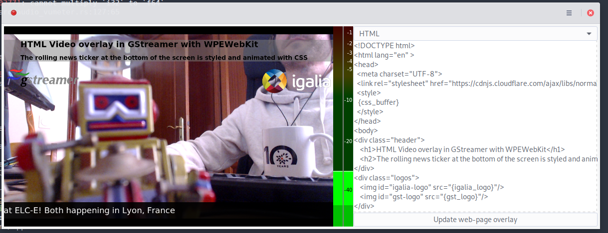

# GStreamer WPE Web Overlay Broadcast demo

This application allows the live video input (webcam) to be mixed with the
contents of a web page and streamed to an RTMP end-point (Twitch, Youtube,...).



## Installation

The application is packaged as a Flatpak app, currently hosted on my server. To
install it run this on your Linux desktop terminal:

```shell
$ flatpak install --user https://software.igalia.com/flatpak-refs/gst-wpe-broadcast-demo.flatpakref
```

The recommended way to run it is also from the terminal because sometimes the UI
hangs up and needs a restart:

```shell
$ flatpak run --user com.igalia.GstWPEBroadcastDemo
```

## Live stream setup

The first time you press the 'record' button the application will ask you to
configure the RTMP URL. It can be done via the settings window, accessible from
the Hamburger menu on top-right corner of the main window. You need to provide
an URL, it differs depending on where you want to live-stream.

### Twitch

In your Twitch channel settings, retrieve the Primary Stream key and copy it in
the pasteboard. In the demo settings, paste it with the following prefix in
order to build a valid RTMP URL: `rtmp://live.twitch.tv/app/`

Users can access the stream using `https://twitch.tv/yourusername`.

### Youtube

In your [Live Dashboard](https://www.youtube.com/live_dashboard) scroll down to
the encoder setup section, reveal the stream key and copy it in pasteboard. In
the following URL, replace `STREAM_KEY` with your secret stream key to build a
valid RTMP end-point URL: `rtmp://a.rtmp.youtube.com/live2/x/STREAM_KEY app=live2`.
The space before `app` is important, don't remove it.

For every new live stream a new Youtube video is created. This is not very
convenient for us, you need to find the URL via the dashboard, on the video
preview, right click and copy the video URL, then share it to the users (booth
visitors).

### Mixer

In your [dashboard](https://mixer.com/dashboard/channel/broadcast), click on the
stream setup link, then select "other software". The fastest end-point URL
should appear on top of the list. Copy its url and the stream key to form a full
URL, example: `rtmp://ingest-hkg.mixer.com:1935/beam/SECRET_STUFF_HERE`.

Users can access the stream using `https://mixer.com/yourusername`.

## Release procedure

- Bump version in `Cargo.toml` and `meson.build`
- Add release info in appstream file
- Commit and tag new version:

        $ git ci -am "Bump to ..."
        $ git tag -s "version..."

- Build tarball:

        $ mkdir -p _build
        $ cargo install cargo-vendor
        $ pip3 install --user -U meson
        $ meson _build
        $ ninja -C _build release

- Publish version and tag:

        $ git push --tags
        $ git push

- Upload tarball from `_build/dist/` to Gitlab


## Credits

The code is based on the [GUADEC 2019 Rust/GTK/GStreamer workshop app](https://gitlab.gnome.org/sdroege/guadec-workshop-2019). Many thanks to Sebastian Dröge <sebastian@centricular.com> and Guillaume Gomez
<guillaume1.gomez@gmail.com>!

The HTML/CSS template is based on the [Pure CSS Horizontal Ticker codepen](https://codepen.io/lewismcarey/pen/GJZVoG).
